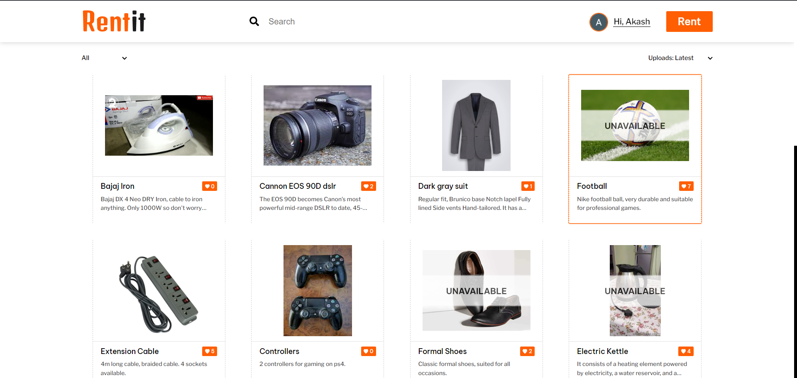

# RentIt App

RentIt is a MERN stack web application developed by Akash Singh. It is a platform where users can easily rent or rent out various products. Whether you are looking to rent something or have something to offer, RentIt provides a convenient and user-friendly experience.

# Live Demo
Check out the live version of RentIt: [RentIt App Live Demo](https://rentit-app.netlify.app/)

# Features
- Browse and search for a wide range of products available for rent
- Save your favorite products for easy access later
- Like and share products with others
- Upload your own products for rent
- Edit and manage your uploaded products
- User-friendly interface and smooth navigation

# Technologies Used
- RentIt is built using the following technologies:
- MongoDB: A NoSQL database used to store product and user information
- Express: A web application framework for Node.js used to build the backend server
- React: A JavaScript library used for building the user interface
- Node.js: A JavaScript runtime used for server-side development
- HTML: The standard markup language for creating web pages
- CSS: A stylesheet language used for designing the application's appearance
- JavaScript: The programming language used for client-side and server-side scripting

# Installation
To run RentIt locally on your machine, follow these steps:

1. Clone the repository: git clone https://github.com/a5h101/rentIt.git
2. Navigate to the project directory: cd rentIt
3. Install the dependencies: npm install
4. Start the development server: npm start
5. Open your browser and visit: http://localhost:3000

# Contributing
Contributions are welcome! If you find any bugs or have suggestions for improvements, please feel free to open an issue or submit a pull request.

# License
This project is licensed under the MIT License.

# Contact
If you have any questions or want to connect with the project developer, you can reach out to Akash Singh at ak45hhere@example.com.

Thank you for your interest in RentIt! We hope you enjoy using the app.
